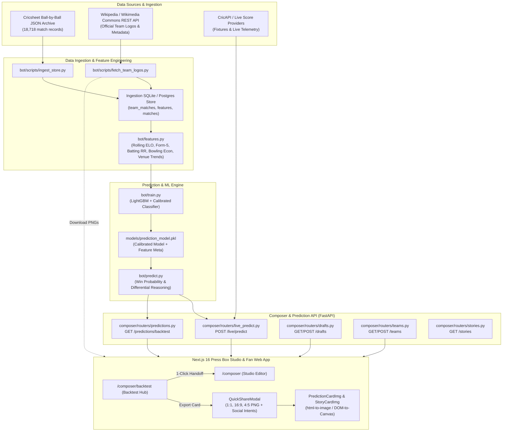

# The Cricket Fan — Architecture & Data Flow Documentation

> **System:** Fan-first Cricket Analytics, Prediction Engine, and Press Box Studio  
> **Tech Stack:** Next.js 16 (App Router, React 19, Tailwind CSS v4, GSAP) + FastAPI (Python 3.12, SQLAlchemy 2.0, LightGBM, Scikit-Learn) + PostgreSQL (Neon) / SQLite  
> **Deployment:** Vercel (Frontend & Serverless Fluid Compute API)  
> **Last Updated:** August 2026

---

## 1. System Overview & Architecture



---

## 2. End-to-End Data Flows

### A. Cricsheet Ingestion & Feature Store
1. **Archive Fetching:** Ingests official JSON ball-by-ball archives across all major T20 & franchise leagues:
   - **Supported Leagues:** IPL, WPL, The Hundred (Men & Women), WBBL, BBL, PSL, CPL, SA20, T20I, WT20I.
   - **Data Volume:** 18,718+ team-match rows spanning 2005 through 2026.
2. **Rolling Feature Computation (`bot/features.py`):**
   - `form5_a` / `form5_b`: Win percentage over previous 5 matches.
   - `bat_rr_a` / `bat_rr_b`: Rolling batting run rate.
   - `bowl_econ_a` / `bowl_econ_b`: Rolling bowling economy rate.
   - `venue_win_pct_a` / `venue_win_pct_b`: Historical venue win rate.
   - `h2h_win_pct_a`: Historical head-to-head dominance.
   - `rest_days_a` / `rest_days_b`: Days since previous match.

---

### B. Machine Learning & Explainable Prediction Pipeline
1. **Model Architecture:**
   - **Base Classifier:** LightGBM gradient boosted decision trees trained on chronological match data (time-series split to prevent lookahead leakage).
   - **Calibration Layer:** `CalibratedClassifierCV` (isotonic regression / sigmoid) ensuring output probabilities represent true empirical win rates.
2. **Explanation Engine (`bot/predict.py`):**
   - Generates 2–3 human-readable match factors explaining the prediction (e.g., *"Trent Rockets batting run rate is 1.4 rpo higher"*, *"Manchester Originals form: 4 wins in last 5"*).
   - Safe fallback to top feature differentials if SHAP explainer is optional or excluded from lightweight deployment footprints.

---

### C. Backtest Engine & Ongoing Season Prediction (`/composer/backtest`)
1. **Historical Backtest Execution:**
   - Evaluates trained model against any historical league season (e.g., IPL 2025, The Hundred 2024, BBL 2023).
   - Computes:
     - **Accuracy & Brier Score**
     - **Log Loss & Calibration Curves**
     - **Simulated Betting ROI** (flat stake & Kelly criterion backtesting)
2. **Ongoing / Future Fixtures Support:**
   - If the selected season is currently active (e.g. *The Hundred 2026*), the engine:
     - Backtests all completed matches with accuracy scoring.
     - Automatically generates win probabilities and feature explanations for upcoming/pending fixtures.
     - Labels upcoming matches with status `"upcoming"` and disables misleading post-match result metrics.

---

### D. Social Sharing Suite & Studio Composer Integration
1. **Quick Share Modal (`QuickShareModal`):**
   - Embedded directly on every match card in the Backtest Hub.
   - **Aspect Ratio Toggles:**
     - `1:1 Square`: Instagram feed, X timeline, LinkedIn.
     - `16:9 Landscape`: Twitter summary cards, YouTube community banners.
     - `4:5 Portrait`: Instagram Stories, WhatsApp status, mobile reels.
   - **One-Click Share Actions:**
     - 📋 **Copy PNG to Clipboard**: Instant paste into social apps.
     - ⬇️ **Download PNG File**: Client-side lossless capture via `html-to-image`.
     - 🐦 **Share to X / Twitter**: Web intent (`https://x.com/intent/tweet?text=...`) with pre-populated hashtags `#TheCricketFan`, venue, and odds.
     - 💬 **Share to WhatsApp**: Web intent (`https://api.whatsapp.com/send?text=...`).
2. **Handoff to Studio Composer (`/composer`):**
   - Clicking **`🚀 Open in Studio Composer`** calls `POST /drafts` with pre-filled card metadata and redirects to `/composer?draft_id={id}`.
   - Studio Composer loads the draft in its state, enabling live typography tweaking, custom color palettes, and scheduled publishing.

---

### E. Team Logo & Crest Pipeline (`bot/scripts/fetch_team_logos.py`)
1. **Wikipedia & Wikimedia REST API Integration:**
   - Uses the Wikimedia PageImages API (`https://en.wikipedia.org/api/rest_v1/page/summary/{title}`).
   - Automatically downloads official team crests into `frontend/public/images/logos/{slug}.png`.
   - Populates `teams.logo_url` in PostgreSQL.
2. **Resolution Fallback Chain (`frontend/src/lib/teamLogo.ts`):**
   $$\text{Local WebP/PNG Asset} \longrightarrow \text{DB } \mathtt{logo\_url} \longrightarrow \text{Wikimedia CDN} \longrightarrow \text{Team Color Initials Badge}$$

---

## 3. API Route Directory

| Route | Method | Description |
|---|---|---|
| `/live/predict` | `POST` | Calculates live win probability and explanatory reasons for two teams at a given venue. |
| `/predictions/backtest` | `GET` | Runs season backtest with ROI, calibration curves, and ongoing match predictions. |
| `/drafts` | `GET`, `POST` | Lists all drafts or creates a new card draft. |
| `/drafts/{draft_id}` | `GET` | Fetches a single draft by ID for direct editor loading. |
| `/teams` | `GET`, `POST` | Manages team branding, color schemes, gradients, and logo URLs. |
| `/stories` | `GET` | Serves long-form match reports, tactical memoirs, and dressing room stories. |

---

## 4. Key CLI Commands & Workflows

### 1. Ingest Data & Train Model
```bash
# Ingest Cricsheet matches into SQLite/Postgres feature store
python -m bot.scripts.ingest_store

# Train LightGBM model across all leagues and save artifact
python -m bot.train --cricsheet-dir /path/to/cricsheet/json --output-dir bot/models/
```

### 2. Fetch Team Logos from Wikipedia
```bash
# Automatically query Wikipedia and download all club crests
python -m bot.scripts.fetch_team_logos
```

### 3. Run Backend & Frontend Locally
```bash
# Start Composer Backend (Port 8000)
bot/.venv/bin/python -m uvicorn composer.app:app --reload --port 8000

# Start Frontend (Port 3000)
cd frontend && npm run dev
```

### 4. Run Test Suites
```bash
# Frontend Unit & Component Tests (Vitest)
cd frontend && npm test -- --run

# Backend Pytest Tests
pytest
```
